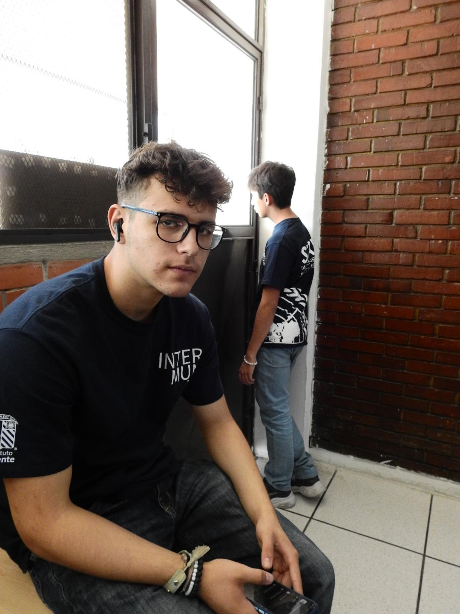
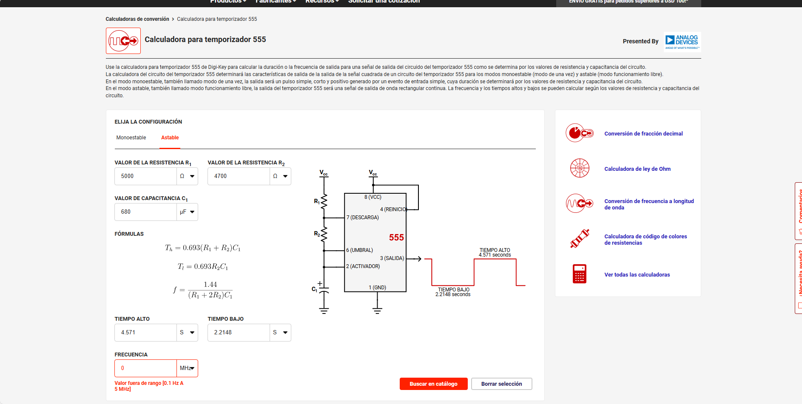

# Documentación del Proyecto de Alejandro Ruiz y Santiago Ortiz

Hola somos Alejandro Ruiz y Santiago Ortiz, estudiantes de Ingenieria Mecatronica en la **Universidad Iberoamericana**

---

# Santiago Ortiz Mucharraz

Soy un estudiante de Ingenieria Mecatronica en la **Universidad Iberoamericana** en el Campus de Puebla.  
El objetivo de esta pagina web es tener un portafolio sobre mis trabajos y proyectos a lo largo de la carrera.  

## Acerca de mi 

**Datos curiosos**  

- Soy egresado de la preparatoria ibero puebla del area de salud
- Mi interes por la mecatronica surgio cuando de niño me subi a un juego mecacnico y se trabo, y tuvieron que prender las luces
- Disfruto de jugar volleyball por el simple hecho de que no se puede jugar solo, y que siempre se necesita al resto del equipo
    - Juego de colocador, que es la posicion que conecta al equipo, asi como el mecatronico conecta a las demas areas  

**Mayor logro**  
Me atreveria a decir que mi mayor logro fue un viaje que tuve recientemente donde visite japon con mi padre. No tanto por el hecho de que haya sido un viaje, si no por el hecho que desde que tengo memoria la cultura, tradiciones, arquitectura, creencias, me han llamado la atencion y siempre quise conocer que hay del otro lado del mundo.  
El viaje a japon me permitio ver que hay mucho mas de lo que uno cree conocer, ver los como los avances tecnologicos se emplean de maneras tan diferentes fue una de las cosas que mas me motivo a escoger Ingenieria mecatronica.  

**Objetivos**  
- **Corto plazo**: Mi objetivo a corto plazo en esta carrera es poder aprender lo basico, tanto de la mecatronica como de la electronica y programacion.  
- **Mediano plazo**: Conforme avance en la carrera, mi objetivo es irme de intercambio a japon, porque quiero vivir como se puede usar la mecatronica de diferentes maneras.  
- **Largo plazo**: Mi objetivo es hacer una doble titulacion con Electronica ya que son las dos areas que mas me gustan de la ingenieria.  

### Contacto  
- Correo: 196901@iberopuebla.mx
- Telefono: +55 221 598 5620
- Teams: 196901@iberopuebla.mx

---

## Alejandro Ruiz Corona

Soy Estudiante de Ingenieria Mecatronica en la **Universidad Iberoamericana** en el Campus Puebla esta pagina web esta diseñada para crear un portafolio de evidencias

## Acerca de mi

**Datos curiosos**

- Tengo interes hacia la mecatronica debido a que de pequeño me gustaba armar y desarmar cosas.
- Hago gym y fui seleccionado de natación con oportunidad de ir a nacionales.
- Me interesa la programación ya que es un nuevo mund para mi.

**Mayor logro** 
Considero que mi mayor logro hasta el momento fue tener la oportunidad de ir a nacionales ya que es una oportunidad muy buena y no se le ofrece a mucha gente, gracias a toda la gente que me enseño las cosas mas importantes y mejorar tecnicas pude llegar hasta ese momento.

**Objetivos**   
- **Corto plazo**: Mi objetivo a corto plazo es tener una buena calificación este semestre y aprender lo basico como electronica y matemáticas.  
- **Mediano plazo**: Mi objetivo a mediano plazo es conseguir un trabajo que tenga que ver con lo que estoy estudiandoy seguir aprendiendo.  
- **Largo plazo**: Mi objetivo a largo plazo es lograr titularme satisfactoriamente de la universidad.

### Contacto  
- Correo: 203982@iberopuebla.mx
- Telefono: +55 222 747 2837
- Teams: 203982@iberopuebla.mx

---

#Primer trabajo
  
##Resumen  

- Nombre del Proyecto: Led intermitente
- Equipo: Santiago Ortiz Mucharraz y Alejandro Ruiz Corona
- Curso: Introduccion a la mecatronica
- Fecha: 05/09/2025
- Descripcion: El trabajo que se realizo el dia 5 de septiembre de 2025, fue un circtuito en una protoboard, el trabajo consistio en hacer que el Led se apagara y se prendiera cada cierto tiempo, en nuestro caso, duraba 6 segundos encedido, y 4 segundos apagado, debido a las resistencias, el capacitador, y la corriente que usamos. 

En la imagen anterior se puede apreciar en calculo de el LED para que pudiera encenderse y apagarse en un tiempo determinado utlilizando resistencias de 5000 y 4700 Ω